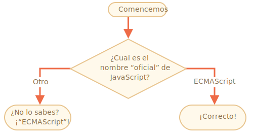

# task

importance: 2

## El nombre de JavaScript

Usando el constructor `if..else`, escribe el código que pregunta: '¿Cuál es el nombre "oficial" de JavaScript?'

Si el visitante escribe "ECMAScript", entonces muestra: "¡Correcto!", de lo contrario muestra: "¿No lo sabes? ¡ECMAScript!"

\[demo src="ifelse\_task2"\]

