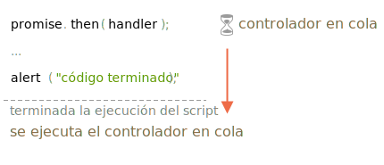

# Microtareas \(Microtasks\)

Los manejadores o controladores \(en adelante controladores\) de promesas `.then`/`.catch`/`.finally` son siempre asincrónicos.

Incluso cuando una promesa es inmediatamente resuelta, el código en las líneas _debajo de_ `.then`/`.catch`/`.finally` se ejecutará antes que estos controladores.

Veamos una demostración:

\`\`\`js run let promise = Promise.resolve\(\);

promise.then\(\(\) =&gt; alert\("¡Promesa realizada!"\)\);

alert\("código finalizado"\); // esta alerta se muestra primero

```text
Si ejecutas esto, verás `código finalizado` primero, y después `¡promesa realizada!`.

Es algo extraño, porque la promesa se realiza por completo desde el principio.

¿Por qué `.then` se disparó después? ¿Qué está pasando?

## Cola de microtareas (Microtasks queue)

Las tareas asincrónicas necesitan una gestión adecuada. Para ello, el estándar ECMA especifica una cola interna `PromiseJobs`, en ocasiones más conocida como "cola de microtareas" (término de V8).

Como se indica en la [especificación](https://tc39.github.io/ecma262/#sec-jobs-and-job-queues):

- La cola es first-in-first-out (FIFO), es decir, primero en entrar primero en salir: la tarea que entró primero en la cola, será la primera en ejecutarse.
- La ejecución de una tarea se inicia sólo cuando *no* se está ejecutando nada más.

O, en palabras más simples, cuando una promesa está lista, sus controladores `.then/catch/finally` se ponen en la cola; ellos aún no se ejecutan. Cuando el motor de Javascript se libera del código actual, toma una tarea de la cola y la ejecuta.

Es por eso que el "código finalizado" en el ejemplo anterior se muestra primero.



Los controladores de promesas siempre pasan por esta cola interna.

Si hay una cadena con múltiples `.then/catch/finally`, entonces cada uno de ellos se ejecuta de forma asincrónica. Es decir, primero se pone en la cola, luego se ejecuta cuando se completa el código actual y se finalizan los controladores previamente en la cola.

**¿y si el orden es importante para nosotros? ¿Cómo podemos hacer que `código finalizado` se ejecute después de `¡promesa realizada!`?**

Fácil, solo ponlo en la cola con `.then`:

```js run
Promise.resolve()
  .then(() => alert("promesa realizada!"))
  .then(() => alert("código finalizado"));
```

Ahora el orden es el previsto.

## Rechazo no controlado

Recuerdas el evento `unhandledrejection` del artículo ?

Ahora podemos ver exactamente cómo Javascript descubre que hubo un rechazo no controlado o _unhandled rejection_

**Se produce un "rechazo no controlado" cuando no se maneja un error de promesa al final de la cola de microtareas.**

Normalmente, si esperamos un error, agregamos `.catch` a la cadena de promesa para manejarlo:

\`\`\`js run let promise = Promise.reject\(new Error\("¡Promesa fallida!"\)\); _!_ promise.catch\(err =&gt; alert\('atrapado'\)\); _/!_

// no se ejecuta: error controlado window.addEventListener\('unhandledrejection', event =&gt; alert\(event.reason\)\);

```text
Pero si olvidas añadir el `.catch`, entonces, después de que la cola de microtareas esté vacía, el motor activa el evento:

```js run
let promise = Promise.reject(new Error("¡Promesa fallida!"));

// Promesa fallida!
window.addEventListener('unhandledrejection', event => alert(event.reason));
```

¿Qué pasa si controlamos el error más tarde? Como esto:

\`\`\`js run let promise = Promise.reject\(new Error\("¡Promesa fallida!"\)\); _!_ setTimeout\(\(\) =&gt; promise.catch\(err =&gt; alert\('atrapado'\)\), 1000\); _/!_

// Error: ¡Promesa fallida! window.addEventListener\('unhandledrejection', event =&gt; alert\(event.reason\)\);

\`\`\`

Ahora si lo ejecutamos, veremos `¡Promesa fallida!` primero y después `atrapado`.

Si no supiéramos acerca de la cola de microtareas podríamos preguntarnos: "¿Por qué se ejecutó el controlador `unhandledrejection`? ¡Capturamos y manejamos el error!

Pero ahora entendemos que `unhandledrejection` se genera cuando se completa la cola de microtareas: el motor examina las promesas y, si alguna de ellas está en el estado "rechazado", entonces el evento se dispara.

En el ejemplo anterior, `.catch` agregado por `setTimeout` también se dispara. Pero lo hace más tarde, después de que `unhandledrejection` ya ha ocurrido, por lo que no cambia nada.

## Resumen

El control de promesas siempre es asíncrono, ya que todas las acciones de promesa pasan por la cola interna de "PromiseJobs", también llamada "cola de microtareas" \(término de V8\).

Entonces, los controladores `.then/catch/finally` siempre se llaman después de que el código actual ha finalizado.

Si necesitamos garantizar que un código se ejecute después de `.then/catch/finally`, podemos agregarlo a una llamada encadenada `.then`.

En la mayoría de los motores de Javascript, incluidos los navegadores y Node.js, el concepto de microtareas está estrechamente relacionado con el "bucle de eventos" o "event loop" y "macrotareas" o "macrotasks". Como estos no tienen relación directa con las promesas, están cubiertos en otra parte del tutorial, en el artículo .

